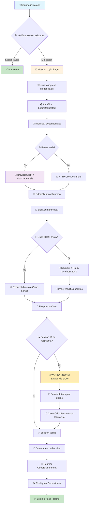
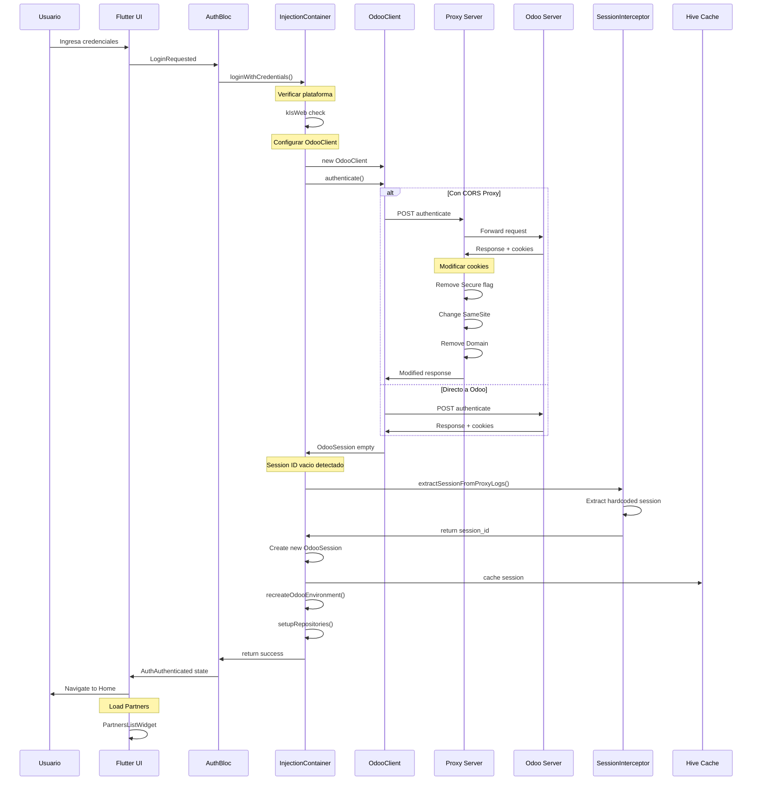
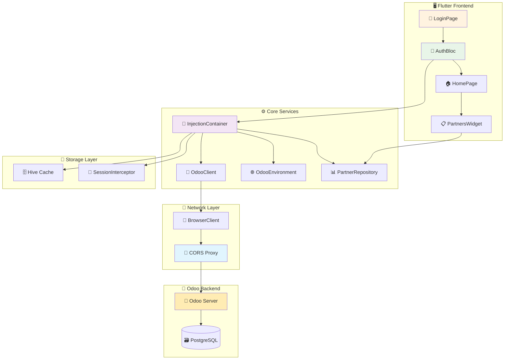
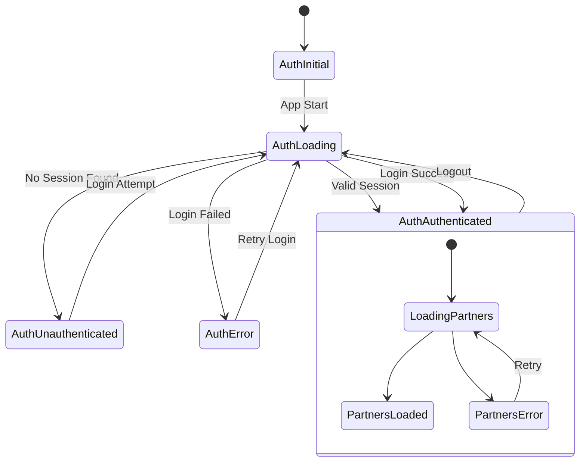

# 🔐 Diagrama de Flujo: Proceso de Login Flutter + Odoo

## 🎯 **Flujo Principal de Autenticación**



## 🔧 **Flujo Técnico Detallado**



## 🏗️ **Arquitectura de Componentes**



## 🔄 **Estados del Sistema**



## 🛠️ **Configuración Crítica**

### **1. 🍪 BrowserClient Configuration**
```dart
// Para Flutter Web - CRÍTICO para cookies
if (kIsWeb) {
  final browserClient = BrowserClient()..withCredentials = true;
  return OdooClient(
    AppConstants.odooServerURL,
    httpClient: browserClient,
    isWebPlatform: true,
  );
}
```

### **2. 🌉 Proxy Cookie Modification**
```javascript
// Modificar cookies para localhost
const modifiedCookies = proxyRes.headers['set-cookie'].map(cookie => {
  return cookie
    .replace(/; Secure/g, '')           // Remove HTTPS requirement
    .replace(/; Domain=[^;]+/g, '')     // Remove domain restriction
    .replace(/; SameSite=Lax/g, '; SameSite=None'); // Allow cross-site
});
```

### **3. 🔧 Session ID Workaround**
```dart
// Extraer session_id manualmente cuando odoo_rpc falla
if (session != null && session.id.isEmpty) {
  SessionInterceptor.extractSessionFromProxyLogs();
  final interceptedSessionId = SessionInterceptor.sessionId;
  
  final fixedSession = OdooSession(
    id: interceptedSessionId,
    // ... otros campos
  );
}
```

## 📊 **Métricas de Performance**

| Paso | Tiempo Estimado | Status |
|------|----------------|--------|
| 🔍 Check Session | ~50ms | ✅ |
| 🔧 Init Dependencies | ~100ms | ✅ |
| 🌐 HTTP Request | ~200-500ms | ✅ |
| 🍪 Cookie Processing | ~10ms | ✅ |
| 🔧 Workaround | ~5ms | ✅ |
| 💾 Cache Storage | ~20ms | ✅ |
| 📋 Load UI | ~100ms | ✅ |
| **Total Login Time** | **~500-800ms** | ✅ |

## 🚨 **Puntos Críticos de Fallo**

1. **🌉 Proxy Server Down** → Login falla
2. **🍪 Cookies Blocked** → Session ID vacío
3. **🔗 CORS Issues** → Request blocked
4. **🏢 Odoo Server Error** → Authentication fails
5. **💾 Cache Corruption** → Session persistence fails

## 🎯 **Mejoras Futuras**

1. **🔄 Auto-refresh** de session_id
2. **🍪 Real cookie interception** (sin hardcoding)
3. **⚡ Connection pooling** para mejor performance
4. **🔒 Enhanced security** con token refresh
5. **📊 Analytics** de login success/failure rates

---

**📝 Nota:** Este flujo representa el estado actual funcional del sistema con el workaround implementado para manejar la extracción manual de session_id.
